# Simple Database GUI Application

<p align="center">


</p>


# Team Members

## Ahmed Eldakhly.
## Mostafa Yossef.
            
#

# Repository Link.
[Simple Database System With GUI](https://github.com/Ahmed-Eldakhly/Sample-Database-Apllication-Bash-Script_GUI.git)

#

# Operations with Photos

## Run the application.
Using terminal run RunMe.sh file.

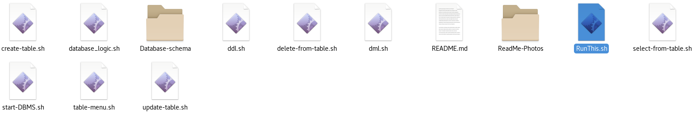

Now The application will work with for main functions.

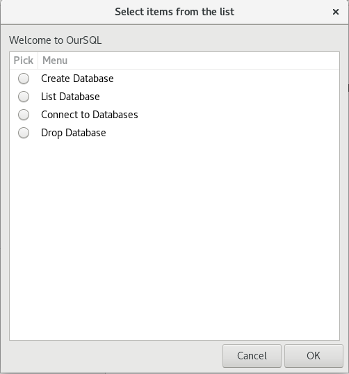

#

# Main Functions.

## 1 - Create Database.
This option ask the user for the name of database and if it didn't exist before, the application will create it as a folder inside Database schema folder.

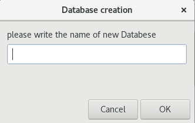

## 2 - List Databases.
This option makes a list for all Databases in the application.

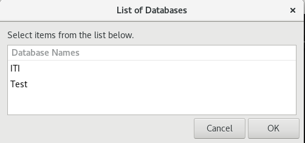


## 3 - Drop Databases.
This option remove Databases from the system.


## 4 - Connect Databases.
This option display all databases for the user to select and give the user access on the selected database tables.

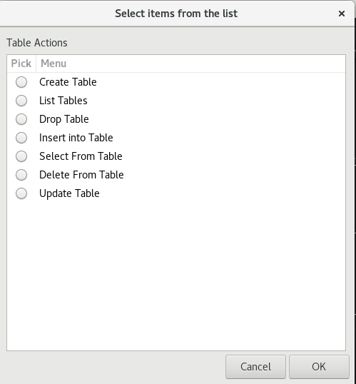

#

# Operations on Tables.

## 1 - Create Tables.
This option ask the user for the name of Table and if it didn't exist before, the application will create it as a 2 files inside current Database folder (.TableName "Meta Data" - TableName) and start to ask the user to add new columns and its datatype (Integar - String - Date - Password) and ask the user about the primary key.

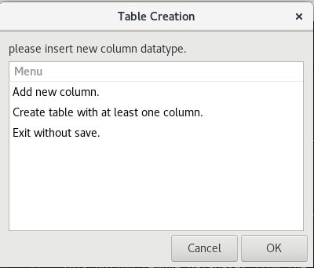 

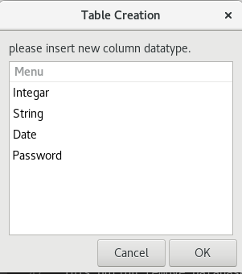

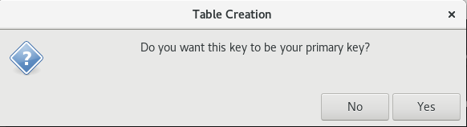

## 2 - List Tables.
This option makes a list for all Tables in the application.

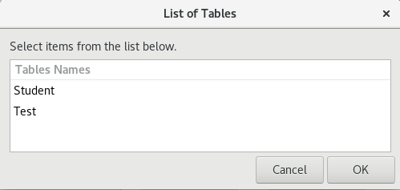


## 3 - Drop Tables.
This option move tables file to trash folder inside the Database. 

NOTE: The user can return it manually from the trash or delete it forever.


## 4 - Insert into table.
This option gives the user the ability to insert new record after selecting the table from the menu of table with many checks (datatype check , primary key check , no null for primary key , no empty fields check and no space in the same field).

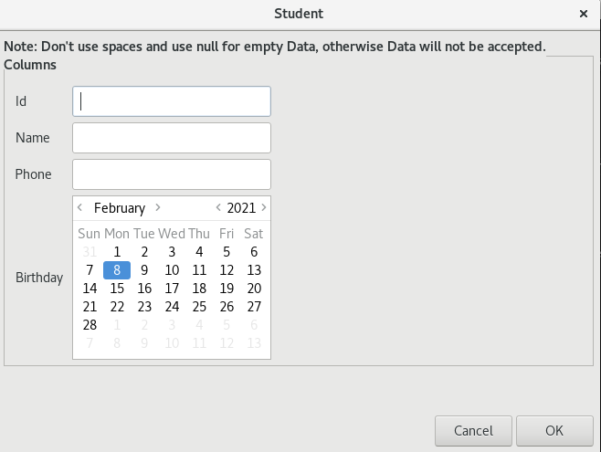


## 5 - Select from table.
Ask the user about specific column and specific value to search for, the he can select which data will be displayed from columns name menu.

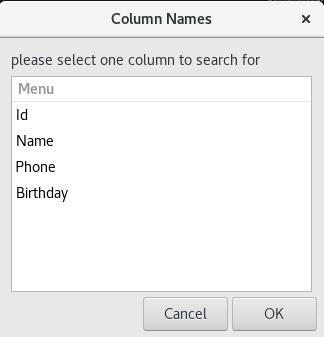

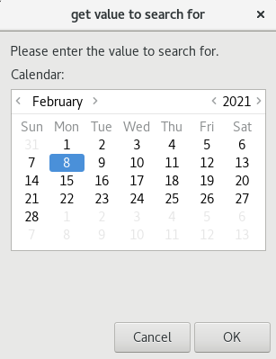

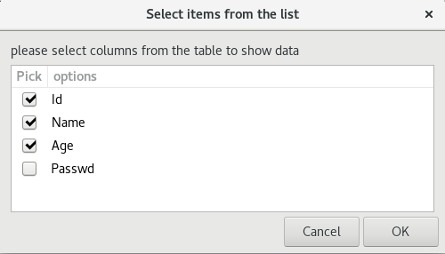

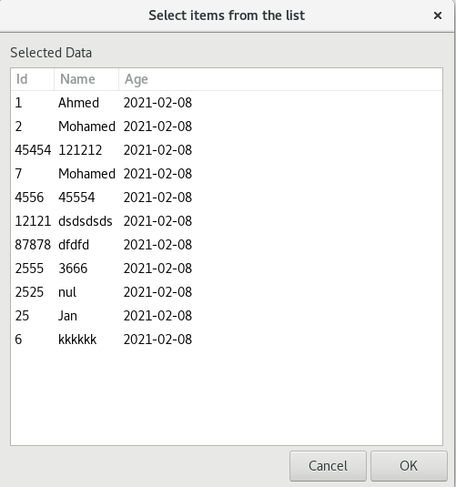


## 6 - Delete from table.
Ask the user about specific column and specific value to search for, then delete all matched records.


## 7 - Update table.
Ask the user about specific column and specific value to search for, then update all matched records one by one with all checks and display old values if he dosen't want to update any value of them.


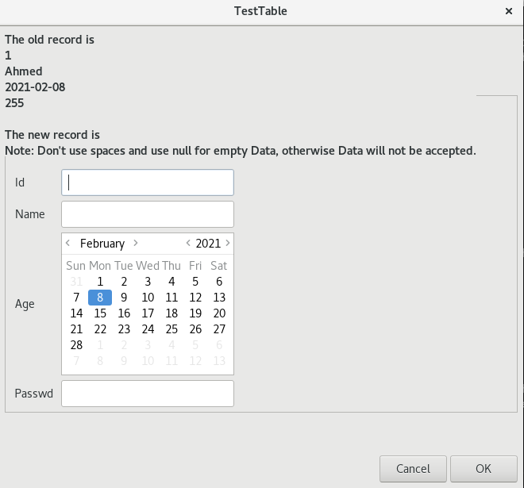

#

# Project files.

1 - RunThis.sh

2 - start-DBMS.sh

3 - database_logic.sh

4 - ddl.sh

5 - table-menu.sh

6 - dml.sh

7 - create-table.sh

8 - delete-from-table.sh

9 - select-from-table.sh

10 - update-table.sh

# 

# Sample of codes.
Sample for Bash shell script files.
```
	#List all tables in current Database
	listTables
	#check if the user presses on cancel or in ok with empty insertion.
	if  [[ $? == 1 || ${#table_name} == 0 ]]
	then
		return
	fi
	typeset -i index=1
	#display column name to make user select which column we will search for to delete its record.
	columsNameArray=`sed -n '1p' .$table_name | sed "s/$DELIMITER/ /g"`
	searchColumn=`zenity --list --title="Column Names" --height="300" --column=Menu $columsNameArray --text="please select one column to search for"`
	#check if the user presses on cancel.
	if  [[ $? == 1 || ${#searchColumn} == 0 ]]
	then
		return
	fi
	#loop to get the number of selected column.
 	for i in ${columsNameArray[@]}
	do
		if [[ $i == $searchColumn ]]
		then
			searchColumn=$index
			break
		fi
		let "index++"
	done
```

#
